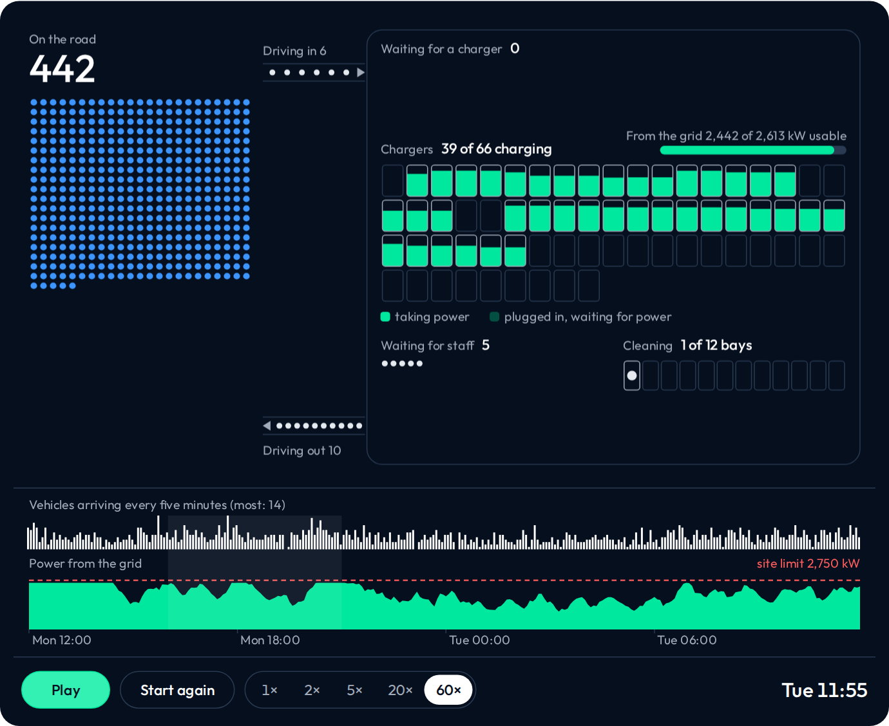

# depot-twin: a digital twin of a robotaxi depot

[](https://github.com/yannickYamo/depot-twin/actions/workflows/ci.yml)

[](https://yannickyamo.github.io/depot-twin/)

*The depot at 500 vehicles on one feeder. Click it to open the live page.*

**depot-twin is a digital twin of a robotaxi depot.** Vehicles serve rides, get called in, queue for a charger, charge under the site's power limit, get cleaned, and go back out.

It answers three questions: how many vehicles one site carries, what breaks first as the fleet grows, and which operating rules get the most from the power the site has.

Live page: https://yannickyamo.github.io/depot-twin/

The site is real: a 14.5-acre industrial parcel in East Oakland, with 2.75 MW of published grid headroom on each of two feeders. The depot on it is hypothetical. This is an independent project built on public data only, not affiliated with or endorsed by Waymo.

## Why I built this

The lease is signed and the grid connection applied for years before the vehicles arrive. How many vehicles the site will carry is decided then, with the least information, and it's the one decision that can't be undone. Chargers and staff arrive in weeks. A grid connection arrives in years.

Today that number comes from a spreadsheet. The spreadsheet is right about the energy and wrong about the day: it can't see the queue, the peak, or the evening when half the fleet comes back empty together.

The mistake shows up in production, either as rides nobody serves or as capital standing idle.

I picked this pain point because the grid is the slowest and least reversible part of a depot, and a total of kilowatt-hours says nothing about a day of operations. So I built the tool that was missing: take a real parcel and a real grid connection, say what it's worth in vehicles, and say what to change first.

## What it found

**Capacity: one feeder carries about 600 vehicles.** That's at 25 rides a day, serving 99% of rides, at the visit cadence the public filings count, three short visits a day. About 700 if vehicles make one long visit a day. That is the capacity when vehicles are called in at a set charge level whether or not a charger is free; a rule that waits for a free charger might carry more.

**The power rule: feeding the emptiest vehicle first is the obvious rule and the wrong one.** Vehicles finish together and wait to be unplugged while power goes unused. Feeding in the order they plugged in takes 1,000 vehicles on one feeder from 77.0% of rides served to 86.1%. It costs nothing.

**Prediction and control: a better forecast buys no rides here, because energy binds first.** It buys a smaller reserve of vehicles. The day-ahead plan buys no rides either. What buys cheaper energy is steering charging around the tariff's evening peak: 6.9% less per kWh at the filings' cadence, 12.2% with long visits, and the plan's hourly optimizer adds nothing to that steering.

More findings, including the visit cadence read from public filings, demand around the parcel (241 vehicles today; a second feeder in 19 months if the measured growth held) and the money, are in `docs/BRIEF.md` and `docs/STORY.md`.

## How it's put together


Three parts, each chosen for a reason, each tested on its own.

A twin, not arithmetic, because the answer depends on queues and timing. Energy arithmetic says the same thing for a fleet that arrives evenly and one that arrives together at six in the evening. The depot doesn't.

XGBoost for the forecast, because the problem is small and tabular (40,789 training rows, a handful of lags, the calendar, a weather forecast) and noisy. Counting noise alone is about 4.6 points at 300 rides an hour, as a theoretical reference. Trees are at the ceiling of what that data holds; a network would need far more of it.

Model predictive control for the plan, because sending vehicles to charge is an allocation under hard limits: site power, chargers, the forecast's upper bound, the price of each hour. A linear program solves that exactly in milliseconds, and planning again every hour corrects the forecast's errors as they arrive. A learned policy would have to rediscover the limits from reward, and can break them while it learns.

The loop: each hour the plan sees where the fleet stands and each vehicle's measured energy use, plans the next 24 hours, and acts on the first one.

## The ML and the statistics

The split is by time, in four blocks: train, a block that decides when to stop adding trees, a block that sizes the upper bound, and 60 held-out days. No row sees its future, and data is never split by row.

The target is the ratio to the same hour last week. Predicting counts missed every bar: rides rose by about 60% between training and test, and trees extrapolate poorly beyond the levels in their training rows.

One hour ahead on San Francisco: 11.4% error against 14.9% for the same hour last week.

The upper bound is judged two ways: how often it holds (92.8% of hours where 95% was asked, stated as a miss) and what it costs, in the vehicles the plan holds in reserve for it.

Where it fails is published. The model is worth most where last week's curve is worst: holidays 13.8% error against 52.8%, weekends 10.5% against 18.1%. It's barely ahead at the evening peak, 13.8% against 14.2%. What it uses is measured by shuffling one input at a time, not read off the model's own ranking.

A forecast for a place with no history is trained across three cities and tested by holding each city out. It passed 1 of 4 bars: good enough to size a depot, not good enough to beat a simple rule everywhere.

A pretrained time-series model, Chronos-2 with no local fitting, is compared on the same days and is better: 8.4% error against 11.4% on San Francisco, and 37 vehicles held in reserve against 53 at the same reliability. On New York taxi days, 7.7% against 9.6%. New York is in its training data, so Chicago (6.5% against 8.0%) and San Francisco are the clean readings.

Each vehicle's energy use is estimated from its own telemetry as the run goes, and fed to the plan.

## How the claims are held

Every headline claim traces to a test with bars fixed before its run. 23 tests, 54 of 95 bars passed. The misses are published. Record: `EVALS.md`; index: `docs/SCOREBOARD.md`.

Every result file carries a stamp of the code that produced it. Change the model and the result is marked stale until it's run again (`depot-twin stale`).

There are two simulators, Python and TypeScript for the browser. Each is held to its own invariants (vehicles, energy and ride-minutes conserved, the site limit never exceeded) and then to each other: within half a point of rides served at 500 vehicles, a point and a half at 1,000. How it was built is in `docs/BUILD_LOG.md`. The figures in this README are read from the result files and tested against them (`docs/FACTS.json`).

## What it doesn't know

Energy per mile is an estimate: 0.53 kWh, where public figures run 0.49 to 0.60. Demand is taxi and ride-hail records, not a robotaxi's own. It's a simulation, not an operations tool.

## How to use it

Install:

```bash
git clone https://github.com/yannickYamo/depot-twin && cd depot-twin
pip install -e ".[data,ml,opt,dev]"
```

Run the power rule on 1,000 vehicles and one feeder. Only `--policy` changes:

```bash
depot-twin fleet scenarios/v2/east_oakland_1000.toml --shape data/derived/weekly_shape_sf.json \
    --recall threshold --policy need_first --seed 1
depot-twin fleet scenarios/v2/east_oakland_1000.toml --shape data/derived/weekly_shape_sf.json \
    --recall threshold --policy slot_power --seed 1
```

Run the page locally:

```bash
cd web && npm ci && npm run dev
```

Checks:

```bash
make check                   # lint, types and the full test suite, as CI runs them
depot-twin eval e14          # reproduce one registered test
depot-twin facts             # check this README's figures against the result files
```

Exact package versions behind the results are in `requirements-frozen.txt`.

## License

Source-available, not open source: you may install and run it for evaluation, research and internal non-commercial use. Modifying, redistributing or building a product on it needs written permission, and the project does not accept contributions. The terms are in `LICENSE`.
