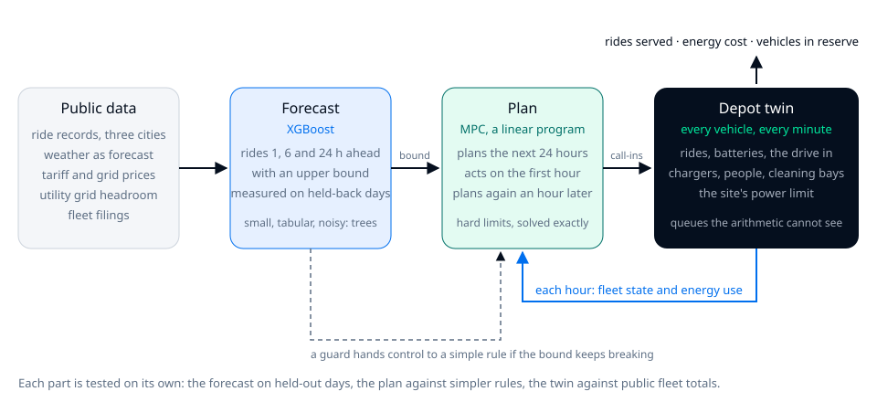

# The Depot Twin

*The owner · October 8, 2026*

**TL;DR: I built a simulated robotaxi depot on a real 14.5-acre parcel in East Oakland, with PG&E's published headroom of about 2.75 MW on each of two feeders, and replayed real San Francisco ride days through it. It answers one question: what is this grid connection worth in vehicles, and what should you change first? Everything here is public data, independent, not affiliated with or endorsed by Waymo.**

## The problem

The decision I built this for is the one that gets made first and can never be taken back. The lease is signed and the grid connection applied for years before any vehicle shows up, and the number of vehicles the site will carry is fixed at that moment, with the least information anyone will ever have.

Chargers arrive in weeks. Staff arrive in weeks, and a grid connection arrives in years.

Today that number comes out of a spreadsheet, and the spreadsheet is right about the energy and wrong about the day. It can't see the queue, and it can't see the peak. It can't see the evening when half the fleet comes back empty at the same time. The cost of being wrong is paid in production, either as rides nobody serves or as capital standing in a yard doing nothing.

So the thing I chose to build was the tool that wasn't there: take a real parcel and a real connection, and say what it's worth in vehicles.

## The product choices

I decided the running depot is the page, and the writing comes second. You see every vehicle, charger, person and bay, a minute at a time. You change the fleet, the grid, the chargers or the rules, and you watch what backs up. Explanation follows what you already saw.

The physics belong to the parcel, and that cost me the ability to flatter anybody. The power dial stops at the two feeders. The load manager draws 95% of a connection, because electrical code treats charging as a continuous load and a load manager keeps a margin. Ask the page for 2,000 vehicles and it will let you, then tell you what the site can't do and why.

Every claim on the page is a test with its bars fixed before the run, and misses published with what each one meant. 23 tests, 54 of 95 bars passed. Every result carries a stamp of the code that produced it, and when the model changes the result is marked stale until someone runs it again. The account counts the way an operator counts, per vehicle-day and per ride, and a ride pays the published average fare of $19.69. Busy pricing moves the price between quiet and busy hours and leaves that average where the filings put it, so a depot that starves its own road doesn't get paid more for doing it. There are five modes: the depot, a recorded run of the full model with its plan hour by hour, the forecast, the money, and this story.

## How it is put together, and why

Three parts, each chosen for a reason, each tested on its own. The first choice was a twin rather than arithmetic, and it cost me a simulator to maintain. Energy arithmetic says the same thing for a fleet that trickles back evenly and a fleet that arrives together at six in the evening. The depot doesn't.

XGBoost for the forecast. The problem is small and tabular, 40,789 training rows, a handful of lags, the calendar, a weather forecast, and it's noisy: counting noise alone is about 4.6 points at 300 rides an hour as a theoretical reference. Trees sit at the ceiling of what that data holds, and a network would need far more of it than I have.

Model predictive control for the plan. Sending vehicles to charge is an allocation under hard limits: site power, chargers, the forecast's upper bound, the price of each hour. A linear program solves that exactly in milliseconds, and replanning every hour corrects the forecast's errors as they arrive. A learned policy would have to rediscover those limits from reward, and can break them while it's learning. The loop is plain: each hour the plan looks at where the fleet stands and each vehicle's measured energy use, plans the next 24 hours, and acts on the first one.

## The ML and the statistics

The split is by time, in four blocks: train, a block that decides when to stop adding trees, a block that sizes the upper bound, and 60 held-out days. No row sees its future, and data is never split by row, and that cost me rows and bought me a number I believe.

The target is the ratio to the same hour last week. Predicting counts missed every bar, because rides rose by about 60% between training and test and trees extrapolate poorly past the levels in their training rows. One hour ahead on San Francisco: 11.4% error against 14.9% for the same hour last week. The upper bound is judged two ways, how often it holds (92.8% of hours where 95% was asked, stated as a miss) and what it costs, in vehicles the plan holds back in reserve.

Where it fails is published. The model is worth most where last week's curve is worst, holidays at 13.8% error against 52.8%, weekends 10.5% against 18.1%, and it's barely ahead at the evening peak, 13.8% against 14.2%. What it uses is measured by shuffling one input at a time, not read off the model's own ranking. A forecast for a place with no history, trained across three cities and tested by holding each city out, passed 1 of 4 bars: good enough to size a depot, not good enough to beat a simple rule everywhere.

A pretrained time-series model, Chronos-2 with no local fitting, beats mine on the same days: 8.4% error against 11.4% on San Francisco, and 37 vehicles held in reserve against 53 at the same reliability. On New York taxi days, 7.7% against 9.6%, though New York is in its training data; Chicago at 6.5% against 8.0% and San Francisco are the clean readings. Each vehicle's energy use is estimated from its own telemetry as the run goes and fed back to the plan. The controller kept its promise of vehicles on the road in 96% to 98% of hours.

## What the tests turned over

The obvious power rule is the wrong one, and finding that out cost nothing and paid the most. Feeding the emptiest vehicle first makes vehicles finish together and then sit waiting to be unplugged while site power goes unused. Feeding them in the order they plugged in, at full rate, moves 1,000 vehicles on one feeder from 77.0% of rides served to 86.1%. Free. It repeated on Chicago days, 85.3% against 78.0%.

I first credited that gain to the day-ahead plan. Taking the controller apart gave it to the power rule: a plain threshold with the same power rule serves as many rides. The plan's worth is energy, and even that is simpler than what I built. Steering charging around the tariff's evening peak pays 12.2% less per kWh with no rides lost, and the plan with its hourly optimizer blind to prices pays exactly the same. The clock does the work.

Past about 700 vehicles on one feeder the plan isn't the one deciding at all: at 1,000, 98% of its calls are the low-battery floor. The runs record which rule was actually in charge. In the forecast chapter, three modelling fixes that helped on San Francisco in development did not carry to other cities: 0 of 4 bars. The forecast's value at this depot isn't rides: the busiest hour needs about 390 of the 500 vehicles on the road and the chargers take about 100 off it, so the fleet just covers it. The forecast moves the energy bill and the reserve, and that's what the page says.

On the money, with the fare held at its published average, scarcity doesn't pay. On one feeder the best fleet at the 99% service floor is 700 vehicles, $126,200 a day. On two feeders the account keeps climbing through 1,200 vehicles, $219,700 a day, the top of what I swept. On the page itself: a station list beside the floor was tried and taken back, names on the floor were tried and taken back, and the forecast page was cut to three questions.

## What the filings said last

The filings don't give trips by tract or session length, so I used what they do give, and it cost me a comfortable assumption. They count chargers and charging sessions and list the tracts served. A vehicle in the real fleet charges every 7.5 to 9 trips, about three times a day. My twin visited 1.3 times, for an hour, and its own study had said more visits cost rides.

E22 closed that gap. The twin reaches the real cadence when vehicles are called in at 55% and cleaned every fourth visit; with a wash on every visit, the same cadence loses twelve points of rides. The cleaning bay was the cost of a visit, not the drive. At that cadence the power rule is worth nine points at 1,000 vehicles, steering by the clock buys energy 6.9% cheaper, and one feeder carries about 600 vehicles at the 99% floor against 700 with long visits. 4 of 4 bars.

E21 went the other way. Served tracts over census populations give 0.17 trips a resident a month, growing 5% a month. The East Bay within 20 km of the parcel makes about 6,000 rides a day today, 241 vehicles, comfortably inside one feeder. As a scenario and not a forecast: if that growth continued, a second feeder in about 19 months; at half of it, 36. 1 of 3 bars. The ramp is faster than I had registered, and the density fit is still owed. The page starts from the place: residents in the service area, the rides they make, the vehicles that is, the month the feeder runs out.

## Two simulators

I implemented the depot twice, Python for the tests and TypeScript for the page, and the cost is two codebases that can drift. Two implementations can fail two ways: they disagree, or they agree and are both wrong. A parity test only catches the first.

So each one is held to its own invariants first, every vehicle in exactly one place, ride-minutes, energy and the site limit conserved, and only then to the other: within half a point of rides served at 500 vehicles and a point and a half at 1,000. Parity isn't correctness.

## When you do not need this, and who answers

You don't need a twin when the fleet is a third of what the feeder carries. Hand arithmetic on energy gives you the same answer for free, and that's where the East Bay is today. You need it at the edge, from about 600 vehicles on one feeder, where queues, the wash and the evening wave decide the outcome and the arithmetic can't see any of them.

The twin informs. The site lead decides the service floor and signs the lease, and answers for both. The twin's job is to make the cost of each choice visible before it's made, not to make the choice. The mistake I'd warn you about is mine: I credited the plan for what the power rule did, and I believed it until I took the controller apart.

## What it found and what it is not

Share power in order before you buy anything. Keep the wash off the charging path. One feeder is about 600 vehicles at 25 rides a day at the real cadence; two carry up to 1,500 with long visits; 2,000 don't fit on this parcel. Today's East Bay demand fits one feeder with room, and at the measured growth that room runs out in 19 months. A day-ahead plan buys no rides, and the clock buys the cheaper energy. Set the service floor as policy, then size to it.

What it isn't: a forecast of demand, since it counts rides served and not rides wanted. Not a robotaxi's own data, since it runs on taxi and ride-hail records calibrated to public fleet totals. Not a live operations tool. The method is the product: a test with its bars fixed first, a miss published, a result tied to the code that made it. 54 sections of build log, 18 recorded turns.

If your siting number came out of a spreadsheet, you already know the energy. What you do not have yet is the day.
